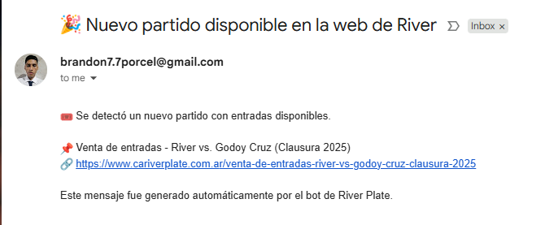

# Entradas River Plate ⚪🔴⚪



Este script monitorea automáticamente nuevas publicaciones de entradas para partidos de River Plate y envía alertas por correo electrónico.<br/>


## 🧠 ¿Cómo funciona?

El sistema consulta periódicamente el sitio oficial o una fuente determinada de entradas y compara contra la última publicación detectada. Si encuentra una nueva, envía una alerta.

## 🚀 Instalación

```bash
git clone https://github.com/brandonporcel/entradas-riverplate.git
cd entradas-riverplate
pip install -r requirements.txt
```

## 🛠 Uso

```
python src/main.py
```

## ⚙️ Automatización

Este script puede ejecutarse automáticamente con GitHub Actions, lo que permite que corra todos los días a una hora determinada.

## ⚙️ To-Do
- [ ] Hacer ui para guardar mails y desuscripción
  - [ ] Usar servicio de mailing y desuscripción desde gmail? 🤔


## 💬 Feedback

Me coparía saber tu opinión. Mandame un mensaje por acá!

- 📧 [Email](mailto:brandon7.7porcel@gmail.com)
- 🌐 [LinkedIn](https://linkedin.com/in/brandonporcel)
